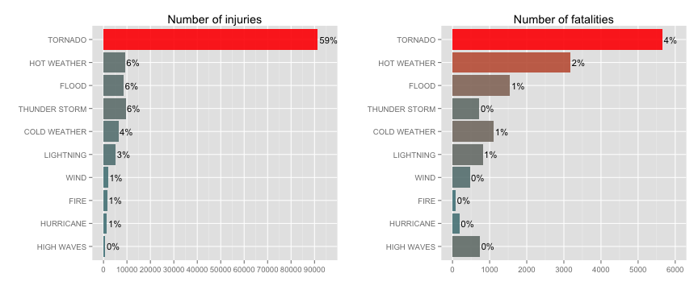

### Synopsis

Storms and other severe weather events can cause both public health and economic problems for communities and municipalities. Many severe events can result in fatalities, injuries, and property damage, and preventing such outcomes to the extent possible is a key concern.

This project involves exploring the U.S. National Oceanic and Atmospheric Administration's (NOAA) storm database. This database tracks characteristics of major storms and weather events in the United States, including when and where they occur, as well as estimates of any fatalities, injuries, and property damage.

The basic goal of this assignment is to describe which weather events have the most 
devastating impact on population health and economy across the USA using data gathered 
over the past 60 years. From these data we found that, for both population health and economy, the most harmful events are tornadoes and floods.  

### Data Processing

First step in conducting this analysis will be downloading and processing data.
The file containing data is downloaded from the [course page](https://class.coursera.org/repdata-015/human_grading/view/courses/973516/assessments/4/submissions). There is also some 
documentation of the database available. Here you will find how some of the variables are constructed/defined.

* National Weather Service [Storm Data Documentation](https://d396qusza40orc.cloudfront.net/repdata%2Fpeer2_doc%2Fpd01016005curr.pdf)

* National Climatic Data Center Storm Events [FAQ](https://d396qusza40orc.cloudfront.net/repdata%2Fpeer2_doc%2FNCDC%20Storm%20Events-FAQ%20Page.pdf)

Since we are interested in health and economic consequences, only the variables
regarding the casualties and damages will be used for further anlysis.


```r
StormData <- read.csv("StormData.csv.bz2")
analysis_data <- StormData[ ,c("EVTYPE","FATALITIES","INJURIES","PROPDMG","PROPDMGEXP","CROPDMG","CROPDMGEXP")]
dim(analysis_data)
```

```
## [1] 902297      7
```

```r
pander(summary(analysis_data), style="rmarkdown", caption = "Original data summary")
```

```
## Error in eval(expr, envir, enclos): could not find function "pander"
```

There are many variations in assigning event type (EVTYPE) to specific weather
events (985 unique values) across the USA, so the events were manually categorized by searching for certain patterns in existing event type names. For instance, all the events described using terms like HEAT|WARM|DRY|HOT|DROUGHT|RECORD TEMP|HIGH TEMP were categorized as HOT WEATHER. Majority of the events were classified in 20 event groups, and the rest were labeled as OTHER (less than 1% of the data). There was no missing data, so we skipped this part of data cleaning process.


```r
library(dplyr)
library(xtable)
library(pander)
library(ggplot2)
library(gridExtra)
tail(analysis_data$EVTYPE)
```

```
## [1] WINTER WEATHER HIGH WIND      HIGH WIND      HIGH WIND     
## [5] BLIZZARD       HEAVY SNOW    
## 985 Levels:    HIGH SURF ADVISORY  COASTAL FLOOD ... wet micoburst
```

```r
sum(!complete.cases(analysis_data))
```

```
## [1] 0
```

```r
analysis_data$EVTYPE <- toupper(analysis_data$EVTYPE)
pattern <- c("VOLCAN","FIRE","HEAT|WARM|DRY|HOT|DROUGHT|RECORD TEMP|HIGH TEMP",
             "FUNNEL","WATERSPOUT","LIGHTNING","FOG","RAIN|SHOWER",
             "WIND|WND|MICROBURST","THUNDER|TSTM","HAIL",
             "SNOW|WINTER|BLIZZARD|ICE|FROST|COLD|COOL|FREEZ|SLEET|HYPO|LOW TEMP","FLOOD|FLD",
             "TSUNAMI|HURRICANE|TYPHOON|STORM SURGE","TROPICAL","TORNADO",
             "RIP|SURF","AVALANCHE","DUST","SLIDE")
type <- c("VOLCANO","FIRE","HOT WEATHER","FUNNEL CLOUD","WATERSPOUT","LIGHTNING","FOG",
          "RAIN","WIND","THUNDER STORM","HAIL","COLD WEATHER","FLOOD","HURRICANE",
          "TROPICAL STORM","TORNADO","HIGH WAVES","AVALANCHE","DUST STORM","LANDSLIDE")

analysis_data$EV_GROUP <- "OTHER"
for (i in 1:length(type)){
     analysis_data$EV_GROUP[grep(pattern[i], analysis_data$EVTYPE)] <- type[i] 
}
```

In original dataset, damage amount is divided in two columns, one containing significant digits and other containing magnitude of the number. To get real damage amount, we multiplied the significant digits by magnitude exponents. From the CROPDMGEXP and PROPDMGEXP summaries above, we can see that majority of the data has exponents H, K, M, B or there is no value at all. In all instances where exponent was some other symbol or a blank space, we just left leading digits as they were, like they were multiplied by 1, beacuse for 99% of them the leading digits were 0 (as we can se from the percentiles calculated below).


```r
quantile(analysis_data$CROPDMG[!analysis_data$CROPDMGEXP %in% c("H","K","M","B")],c(0.25,0.5,0.75,0.99))
```

```
## 25% 50% 75% 99% 
##   0   0   0   0
```

```r
quantile(analysis_data$PROPDMG[!analysis_data$PROPDMGEXP %in% c("H","K","M","B")],c(0.25,0.5,0.75,0.99))
```

```
## 25% 50% 75% 99% 
##   0   0   0   0
```

```r
total_dmg <- function(dmg, tot_dmg) {
        exp <- c("H","K","M","B")
        multi <- c(100, 1000, 1000000, 1000000000)
        for(i in 1:length(exp)){
                tot_dmg[toupper(dmg) == exp[i]] <- tot_dmg[toupper(dmg) == exp[i]]*multi[i]
        }
        return(tot_dmg)
}
analysis_data$PROPDMG <- total_dmg(analysis_data$PROPDMGEXP, analysis_data$PROPDMG)
analysis_data$CROPDMG <- total_dmg(analysis_data$CROPDMGEXP, analysis_data$CROPDMG)
pander(summary(analysis_data$PROPDMG), style = "rmarkdown", caption = "Property damage summary")
```


|  Min.  |  1st Qu.  |  Median  |  Mean  |  3rd Qu.  |   Max.   |
|:------:|:---------:|:--------:|:------:|:---------:|:--------:|
|   0    |     0     |    0     | 473600 |    500    | 1.15e+11 |

Table: Property damage summary

```r
pander(summary(analysis_data$CROPDMG), style = "rmarkdown", caption = "Crop damage summary")
```


|  Min.  |  1st Qu.  |  Median  |  Mean  |  3rd Qu.  |  Max.  |
|:------:|:---------:|:--------:|:------:|:---------:|:------:|
|   0    |     0     |    0     | 54420  |     0     | 5e+09  |

Table: Crop damage summary

## Results

Lets take a look at how often do certain types of weather events actually occur. As we can se from the table below, thunder storms, hail, floods, and tornadoes are the most common weather events across the USA.


```r
count_data <- as.data.frame(count(analysis_data, EV_GROUP))
count_data$pct <- with(count_data, paste(round(n/sum(n),2)*100, "%", sep=""))
names(count_data) <- c("EV_GROUP", "FREQ", "PCT")
count_data <- count_data[order(-count_data$FREQ),]
knitr::kable(xtable(count_data[1:10,]), caption = "**Table 1:** Top 10 most commont weather events", 
             row.names = F, align = c("l","c","c"))
```


|EV_GROUP      |  FREQ  | PCT |
|:-------------|:------:|:---:|
|THUNDER STORM | 335692 | 37% |
|HAIL          | 290399 | 32% |
|FLOOD         | 86120  | 10% |
|TORNADO       | 60700  | 7%  |
|COLD WEATHER  | 46576  | 5%  |
|WIND          | 26778  | 3%  |
|LIGHTNING     | 15760  | 2%  |
|RAIN          | 11851  | 1%  |
|FUNNEL CLOUD  |  6980  | 1%  |
|HOT WEATHER   |  5600  | 1%  |

### Health Consequences

Fatalities and injuries were aggregated per event group. Aggregated data as well as 
proportions of casualties per weather type are displayed in subsequent table. From 
*Table 2* we can see that there are much more injuries caused by wether events 
than fatalities.


```r
health_data <- aggregate(.~EV_GROUP, data = analysis_data[,c(2,3,8)], FUN = sum)
health_data$TOTAL <- health_data$FATALITIES + health_data$INJURIES
health_data <- health_data[order(-health_data$TOTAL),]

health_data$FATALITIES_PCT <- with(health_data, paste(round(FATALITIES/sum(TOTAL),2)*100,"%",sep=""))
health_data$INJURIES_PCT <- with(health_data, paste(round(INJURIES/sum(TOTAL),2)*100,"%",sep=""))
health_data$TOTAL_PCT <- with(health_data, paste(round(TOTAL/sum(TOTAL),2)*100,"%",sep=""))

data_table <- xtable(health_data[ ,c(1:4,7)])
knitr::kable(data_table[1:10,], caption = "**Table 2:** Top 10 harmful weather events in USA", row.names = F, 
             align = c("l","c","c","c","c"))
```


|EV_GROUP      | FATALITIES | INJURIES | TOTAL | TOTAL_PCT |
|:-------------|:----------:|:--------:|:-----:|:---------:|
|TORNADO       |    5661    |  91407   | 97068 |    62%    |
|HOT WEATHER   |    3178    |   9247   | 12425 |    8%     |
|FLOOD         |    1553    |   8683   | 10236 |    7%     |
|THUNDER STORM |    725     |   9448   | 10173 |    7%     |
|COLD WEATHER  |    1110    |   6374   | 7484  |    5%     |
|LIGHTNING     |    817     |   5231   | 6048  |    4%     |
|WIND          |    468     |   1924   | 2392  |    2%     |
|FIRE          |     90     |   1608   | 1698  |    1%     |
|HURRICANE     |    192     |   1505   | 1697  |    1%     |
|HIGH WAVES    |    738     |   775    | 1513  |    1%     |

Top five weather events which account for almost 90% of all the casualties are *tornadoes,
floods, very hot or very cold weather and thunder storms*. However, the number of tornado
casualties exceeds by far all the others, making *tornadoes* the most dangerous weather events
in the USA over the past 60 years. As it can be seen on the *Figure 1* fatalities make around 10% of total weather events casualties. *In this context, casualties are both injuries and
fatalities.*


```r
p1 <- ggplot(health_data[1:10,], aes(x = reorder(EV_GROUP, TOTAL), y = INJURIES)) + 
        geom_bar(stat = "identity", aes(fill = INJURIES), alpha = 0.9) +
        scale_fill_gradientn(colours = c("cadetblue4","red")) +
        geom_text(aes(label = INJURIES_PCT), hjust = -0.1, size = 4) +
        labs(title = "Number of injuries", x = "", y = "") + 
        scale_y_continuous(breaks = seq(0,95000,10000), limits = c(0,95000)) +
        guides(fill = F) +
        coord_flip()
p2 <- ggplot(health_data[1:10,], aes(x = reorder(EV_GROUP, TOTAL), y = FATALITIES)) + 
        geom_bar(stat = "identity", aes(fill = FATALITIES), alpha = 0.9) + 
        scale_fill_gradientn(colours = c("cadetblue4","red")) +
        geom_text(aes(label = FATALITIES_PCT), hjust = -0.1, size = 4) +
        labs(title = "Number of fatalities", x = "", y = "") + 
        scale_y_continuous(breaks = seq(0,6000,1000), limits = c(0,6000)) +
        guides(fill = F) +
        coord_flip()
grid.arrange(p1, p2, ncol = 2)
```

 

### Economic Consequences

Property and crop damages were aggregated per event group. Proportion of damages
for every event group was calculated. Concrete numbers and graphics are presented
for top 10 damaging events. From *Table 3* we can see that crop damage is overall
much smaller than property damage.


```r
damage_data <- aggregate(.~EV_GROUP, data = analysis_data[,c(4,6,8)], FUN = sum)
damage_data$TOTALDMG <- damage_data$PROPDMG + damage_data$CROPDMG
damage_data$DMG_PCT <- with(damage_data, paste(round(TOTALDMG/sum(TOTALDMG),2)*100, "%", sep=""))
damage_data$CDMG_PCT <- with(damage_data, paste(round(CROPDMG/sum(TOTALDMG),2)*100, "%", sep=""))
damage_data$PDMG_PCT <- with(damage_data, paste(round(PROPDMG/sum(TOTALDMG),2)*100, "%", sep=""))
damage_data <- damage_data[order(-damage_data$TOTALDMG),]
```


```r
data_table <- xtable(with(damage_data, 
                          cbind(EV_GROUP, PROPDMG = format(PROPDMG, scientific = FALSE, big.mark = ","), 
                                CROPDMG = format(CROPDMG, scientific = FALSE, big.mark = ","), 
                                TOTALDMG = format(TOTALDMG, scientific = FALSE, big.mark = ","), DMG_PCT)))
knitr::kable(data_table[1:10,1:5], caption = "**Table 3:** Property and crops damage", 
             align=c("l","c","c","c","c"))
```


|EV_GROUP       |     PROPDMG     |    CROPDMG     |    TOTALDMG     | DMG_PCT |
|:--------------|:---------------:|:--------------:|:---------------:|:-------:|
|FLOOD          | 167,587,944,582 | 12,388,597,200 | 179,976,541,782 |   38%   |
|HURRICANE      | 133,465,196,010 | 5,516,992,800  | 138,982,188,810 |   29%   |
|TORNADO        | 58,593,098,029  |  417,461,520   | 59,010,559,549  |   12%   |
|COLD WEATHER   | 12,695,167,213  | 8,735,107,900  | 21,430,275,113  |   4%    |
|HAIL           | 16,019,991,567  | 3,111,712,873  | 19,131,704,440  |   4%    |
|HOT WEATHER    |  1,066,431,750  | 14,877,045,280 | 15,943,477,030  |   3%    |
|THUNDER STORM  | 10,930,782,632  | 1,206,853,738  | 12,137,636,370  |   3%    |
|FIRE           |  8,496,628,500  |  403,281,630   |  8,899,910,130  |   2%    |
|TROPICAL STORM |  7,716,127,550  |  694,896,000   |  8,411,023,550  |   2%    |
|WIND           |  6,087,855,723  |  767,345,400   |  6,855,201,123  |   1%    |

Floods, hurricanes and tornadoes account for 80% of the total damages.
Again, there is one type of events that causes by far the most damage - *floods*.
As expected, most of the crop damages are caused by *drought, floods and cold weather*.
With crop damages share of only 10%, property damages take up significantly larger 
portion of total damages. *Total damages are property and crop damages combined.*


```r
p1 <- ggplot(damage_data[1:10,], aes(x = reorder(EV_GROUP, TOTALDMG), y = PROPDMG)) + 
        geom_bar(stat = "identity", aes(fill = PROPDMG), alpha = 0.9) + 
        geom_text(aes(label = PDMG_PCT), hjust = -0.1, size = 4) +
        scale_fill_gradientn(colours = c("cadetblue4","red")) +
        labs(title = "Property damage", x = "", y = "Damage ($)") + 
        ylim(c(0,1.85e+11)) +
        guides(fill = F) +
        coord_flip()
p2 <- ggplot(damage_data[1:10,], aes(x = reorder(EV_GROUP, TOTALDMG), y = CROPDMG)) + 
        geom_bar(stat = "identity", aes(fill = CROPDMG), alpha = 0.9) + 
        geom_text(aes(label = CDMG_PCT), hjust = -0.1, size = 4) +
        scale_fill_gradientn(colours = c("cadetblue4","red")) +
        labs(title = "Crop damage", x = "", y = "Damage ($)") + 
        guides(fill = F) +
        coord_flip()
grid.arrange(p1, p2, ncol = 2)
```

 

**Conclusion:** We have seen that when it comes to endangering population health, tornado
is the most dangerous weather event. Most property damages are caused by floods, hurricanes, and tornadoes, while crops are destroyed mostly by extreme temperatures (high and low) and floods. If we would create a list of harmful events with respect to health and economic consequences combined, **tornadoes and floods** would be at the very top.

This analysis considers USA data for the past 60 years, so the next step could be checking up
state wise data, maybe only for more recent years, or analysing data per month to see if 
there is a part of the year when the weather is particularly bad.


```r
sessionInfo()
```

```
## R version 3.2.0 (2015-04-16)
## Platform: x86_64-apple-darwin13.4.0 (64-bit)
## Running under: OS X 10.10.3 (Yosemite)
## 
## locale:
## [1] C
## 
## attached base packages:
## [1] grid      tools     stats     graphics  grDevices utils     datasets 
## [8] methods   base     
## 
## other attached packages:
## [1] gridExtra_0.9.1 ggplot2_1.0.1   pander_0.5.2    xtable_1.7-4   
## [5] dplyr_0.4.2     knitr_1.10.5   
## 
## loaded via a namespace (and not attached):
##  [1] Rcpp_0.11.6      magrittr_1.5     MASS_7.3-40      munsell_0.4.2   
##  [5] colorspace_1.2-6 R6_2.0.1         highr_0.5        stringr_1.0.0   
##  [9] plyr_1.8.3       parallel_3.2.0   gtable_0.1.2     DBI_0.3.1       
## [13] htmltools_0.2.6  lazyeval_0.1.10  yaml_2.1.13      assertthat_0.1  
## [17] digest_0.6.8     reshape2_1.4.1   formatR_1.2      codetools_0.2-11
## [21] evaluate_0.7     rmarkdown_0.7    labeling_0.3     stringi_0.4-1   
## [25] scales_0.2.5     proto_0.3-10
```


-------
This report was generated with [R](http://www.r-project.org/) (3.2.0) and [pander](https://github.com/rapporter/pander) (0.5.2) on x86_64-apple-darwin13.4.0 platform.
